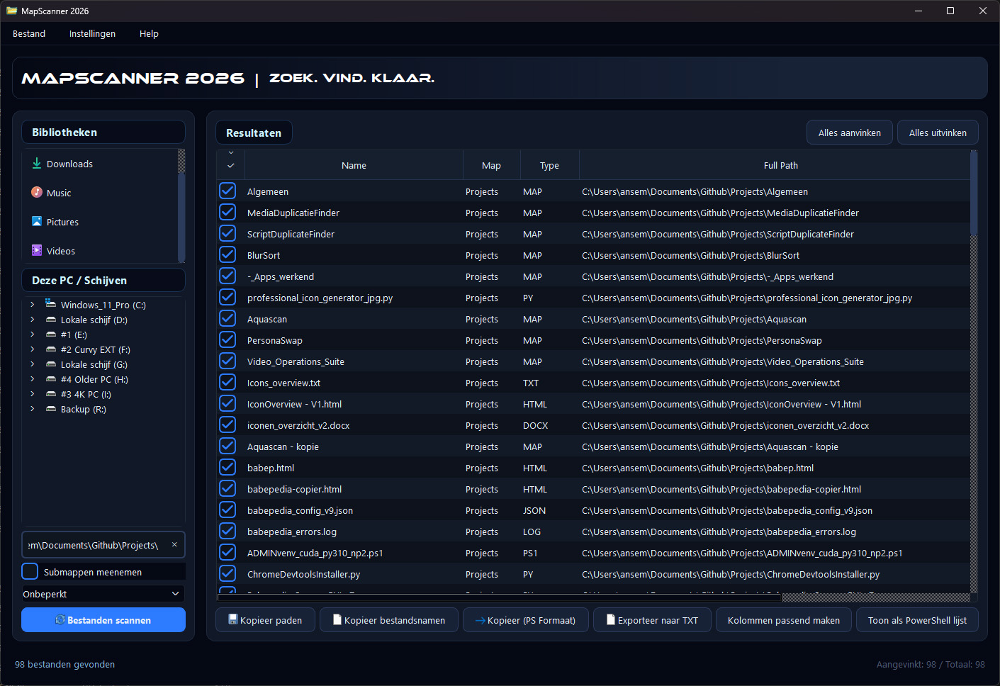

# MapScanner 2026

MapScanner 2026 is a desktop file scanner built with Python and PySide6.

It scans folders and drives, lists files in a structured table, and lets you copy or export filenames, paths, and metadata quickly.

## Screenshot



## Overview

- Desktop file scanner for Windows
- Built with Python and PySide6
- Sortable result columns
- Copy paths, filenames, or PowerShell-formatted output
- Export checked results to TXT
- Multilingual UI: Dutch, English, German, Spanish
- Optional media-duration scanning through `ffprobe`

## Logo

<p align="center">
  
</p>

## Requirements

- Windows
- Python 3.10 or newer
- `ffprobe` in `PATH` for media-duration detection

## Install

```powershell
python -m venv .venv
.venv\Scripts\Activate.ps1
pip install -r requirements.txt
```

## Run

```powershell
python .\MapScanner_2026_v1.py
```

## Runtime Files

Keep these files next to the Python script when running directly:

- `MapScanner_2026_v1.py`
- `MapScanner_icon.ico`
- `MapScanner_logo (2).png`
- `Ethnocentric Rg.otf`
- `check_white.svg`

## Repository

- GitHub: [https://github.com/Rymnda/MapScanner_2026](https://github.com/Rymnda/MapScanner_2026)
- Profile: [https://github.com/Rymnda](https://github.com/Rymnda)

## License

Released under the MIT License. See [LICENSE](LICENSE).
